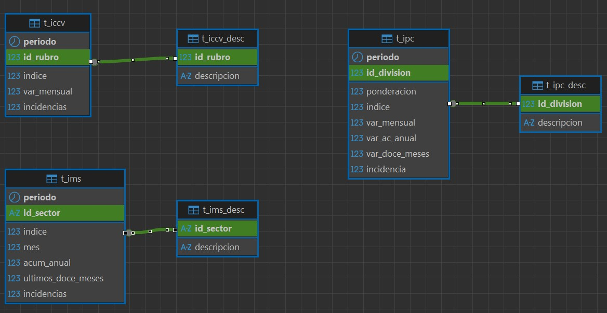

<div style="display: flex; justify-content: space-between; align-items: flex-start; width: 100%; border-bottom: 1px solid #333; padding-bottom: 10px;">

  <div style="display: flex; flex-direction: column;">
    <h2 style="margin: 0; font-size: 2.5em;">Web to BI</h2>
    <h4 style="margin: 5px 0 0 0; font-weight: normal; color: #888;">
      Obtencion de informacion mediante Webscrapping. <br>
      Persistencia en base de datos MySQL en AWS. <br>
      Creacion de paneles mediante Power Bi.
    </h4>
  </div>

  

</div>


## 📌 Descripción
Este proyecto es una solución integral de Inteligencia de Negocios (BI) diseñada para automatizar la extracción, almacenamiento y visualización de datos estratégicos provenientes de la web. La herramienta elimina recolección manual de datos, transformando información de internet en dashboards interactivos y accionables que facilitan la toma de decisiones en tiempo real.

## ⚠️ Disclaimer
Dado que las estructuras de los sitios web cambian frecuentemente, no se garantiza la continuidad del funcionamiento de los scripts de extracción ni la integridad de los datos obtenidos en el futuro.

## 🚀 Funcionalidades Clave
* **Extracción Automatizada (Web Scraping)**
  * Motor de Navegación: Implementación de Selenium WebDriver para la extracción de datos en entornos dinámicos.
  * Robustez: Capacidad de interactuar con elementos complejos de la interfaz de usuario, garantizando la captura de datos que requieren renderización de JavaScript.
* **Infraestructura y Persistencia de Datos**
  * Cloud Hosting: Despliegue de una instancia de MySQL en AWS (Amazon Relational Database Service), asegurando alta disponibilidad y escalabilidad.
  * Seguridad: Gestión de acceso mediante variables de entorno (archivo .env), siguiendo las mejores prácticas para la protección de credenciales sensibles y configuración del entorno.
  * Optimización de Consultas: Arquitectura basada en Stored Procedures (Procedimientos Almacenados) para estandarizar procesos, reducir la latencia de red y mejorar el rendimiento de las operaciones.
* **Visualización e Inteligencia de Negocio**
  * Dashboards Dinámicos: Diseño de informes interactivos en Power BI que transforman datos crudos en indicadores clave de rendimiento (KPIs).
  * Integración Avanzada: Uso de Scripts de Python dentro de Power BI para el pre-procesamiento avanzado de datos y la automatización de la actualización de los modelos visuales.

## 🛠️ Stack Tecnológico
* **Lenguaje:** Python 3.11.7
* **Librerías principales:** Selenium 4.28.1, Requests 2.32.4, PyMySQL 1.1.2
* **Gestion Base de Datos:** DBeaver.
* **Versionado:** GitHub.

## 📋 Estructura del Repositorio
```text
├── imgs/                 # imagenes para el archivo .md
├── sql/                  # querys DQL y DDL
├── power_bi/             # codigo de muestra a ejecutar dentro de powerbi
├── src/
  ├── webscrap
    ├── utils.py          # metodos auxiliares del modulo
    ├── blueprint.py      # clases plantilla
    ├── controller.py     # orquestador del modulo
    ├── iccv.py           # obtencion de datos de iccv
    ├── ims.py            # obtencion de datos de ims
    ├── ipc.py            # obtencion de datos de ipc
  ├── connection
    ├── blueprint.py      # clases plantilla
    ├── controller.py     # creacion del engine para conexion a MySQL
  ├── utils.py            # metodos auxiliares del main
├── main.py               # orquestador del proyecto
├── .env                  # credenciales de conexion a AWS
├── config.py             # contiene variables estátticas como rutas o nombres
├── requirements.txt      # Dependencias del proyecto (auditado con pip-audit)
└── README.md             # Documentación principal
```

## 🗄️ Estructura base de datos
La base de datos contiene seis tablas, tres con la informacion descargada mediante webscrapping, y otras tres con informacion adicional que no vale la pena persistir en la tabla principal dado que es repetitiva.
<div align="center">
  
</div>

## 👣 Funcionamiento
* **Obtencion de datos**
Ejecutar `main.py` en la raiz del proyecto.
La herramienta le solicitara al usuario el Año y Mes de la informacion que se desea persistir.
Luego de ciertas comprobaciones, se abrira un navegador Chrome mediante Selenium, con el cual se obtendra la informacion solicitada.
Una vez terminado el proceso de WebScrapping, se genera el motor de conexion a la base de datos, para luego persisitr la data en las tablas correspondientes.

* **Gestion de base de datos**
Generar la conexion a la base de datos mediante algun gestor como ser DBeacer o Workbench.
Ejecutar las querys dentro de la carpeta `sql`.
Revisar datos persistidos en el punto anterior.

* **Dashboard**
Abrir Power Bi.
Datos -- Obtener datos -- Script de Python.
Pegar el script dentro de `power_bi/example_script.py`, o modificarlo a conveniencia.
Importar los datos.
Repetir el proceso tantas veces como sea necesario.
Generar dashboard.

## ▶️ Videos
* **Obtencion y persistencia de datos**
<div align="center">
  <a href="https://www.youtube.com/watch?v=HUpE8b6IHrY">
    
  </a>
</div>

* **Dashboard Power Bi**
<div align="center">
  <a href="https://www.youtube.com/watch?v=_vQ5F9mJHWc">
    
  </a>
</div>
